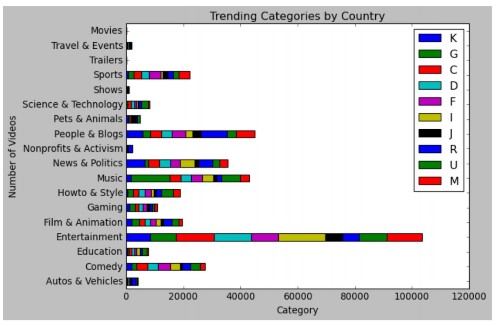
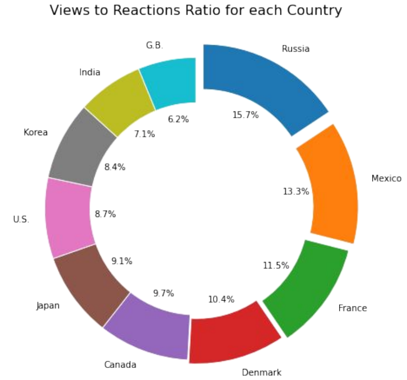
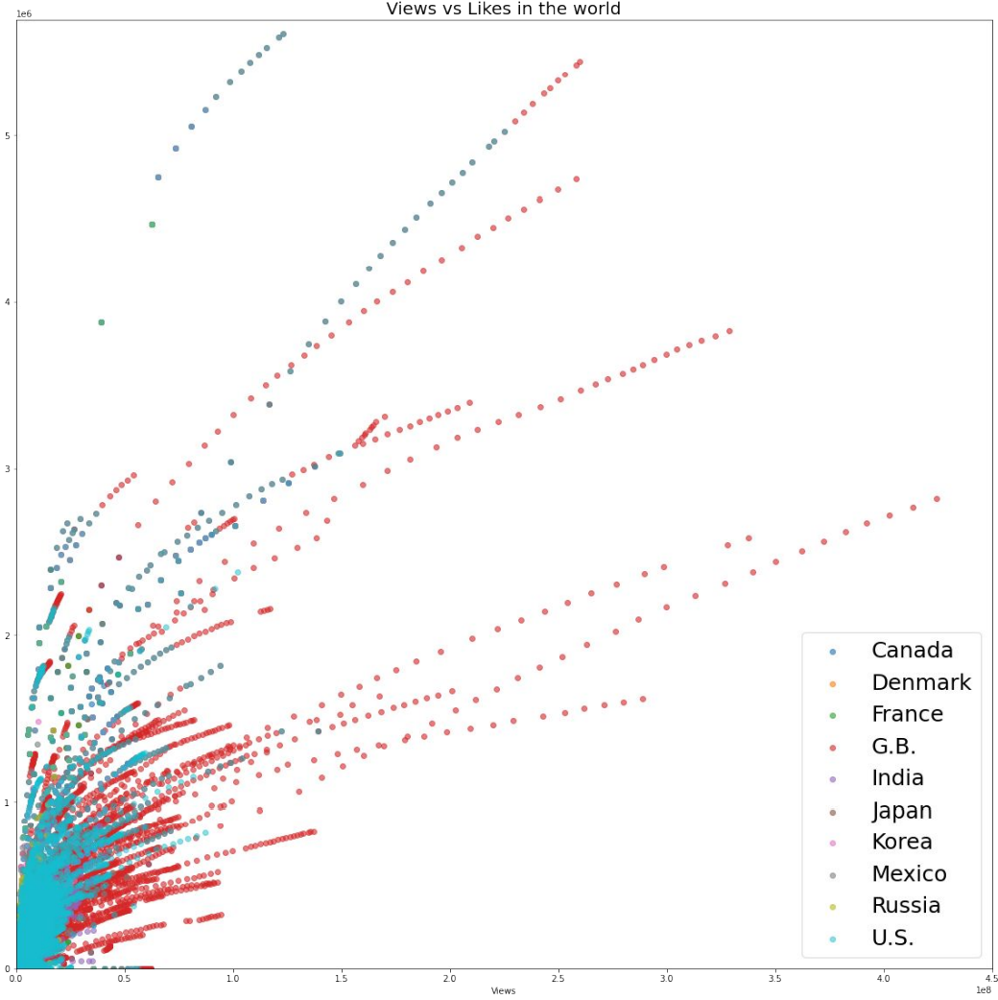
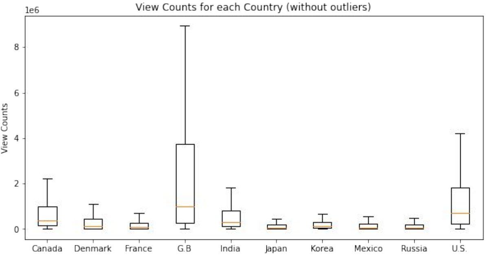

# Youtube Trending Video Analysis
The purpose of this project is to analyze Youtube trending videos from 10 most active countries statistics data from 11.14.17 to 06.14.18. This project focuses on what categories of videos are most popular and how viewers in different countries interact with content differently by looking at the likes, dislikes, comments, etc.

To see the full report and more visualizations, please see the powerpoint located in `powerpoint`.

### Dataset Sources:
* https://www.kaggle.com/datasnaek/youtube-new?select=USvideos.csv

---

### Project Description
**Step 1: Questions**
* This project prioritizes on the following questions below:
  1. Are there trends within different countries? If so, what are the types of trending categories?
  2. Is it possible to predict future viewer values on future videos based on the data we have now? 
  3. Is there any correlation between trending videos and negative reactions? How does the number of dislikes relate to trending videos?
	4. Are videos removed due to the number of dislikes? what about the videos that have comments blocked?
  5. Is there a distribution of attributes pattern for trending video views, comments, and likes?

**Step 2: Data Cleaning and Analysis**
* Clean up the CSV by making sure it is in `utf-8` encoding.
* Drop rows that contains `N/A` data.
* Replace categories from number to the actual category title by looping through json files.
* Use various visualization tools in matplotlib to analyze the cleaned data.

---

### Example Screenshots
**Trending Categories by Country**

**Views to Reactions by Country**

**Views vs. Likes**

**View Count by Country**

---

### Team Members:
* [Jeongdae (JD) Kwak](https://github.com/jdkwak1994)
* [Max Izotov](https://github.com/maximizo)
* [Mark Gu](https://github.com/markgu713)
* [Samuel Okunola](https://github.com/samuelokunola326)
* [Sabikha Khatun](https://github.com/Sabikha20)
